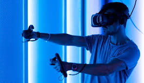

<!DOCTYPE html>
<html lang="en">
<head>
    <link rel="stylesheet" href="home.css">
    <meta charset="UTF-8">
    <meta http-equiv="X-UA-Compatible" content="IE=edge">
   <meta name="viewport" content="width=device-width, initial-scale=1">

    <!-- Google Icon Font -->
<link href="https://fonts.googleapis.com/icon?family=Material+Icons" rel="stylesheet">
    <!-- jQuery CDN -->
   
    <!-- Materialize CDN here -->
 <link rel="stylesheet" href="https://cdnjs.cloudflare.com/ajax/libs/materialize/1.0.0/css/materialize.min.css">
  
  
  
 
    <!-- JavaScript/jQuery Function Initialization inside   -->

  
    
     
</head>

<body>
   
   
 
   <nav >
    

      
      
      <ul id="nav-mobile" class="right hide-on-med-and-down">
        <li><a class="curent" href="Startpage.html">Home</a></li>
        <li><a href="infopage.html">Information Page</a></li>
        <li><a href="Thecrew.html">About Us</a></li>
        <li><a href="contactUs.html"> Contact Us</a></li>
        <li><a href="Sprint1FAQ.html">FAQ</a></li>
      </ul>
    

  </nav>
    
    <header>
        <h1>Explore the World of VR Headsets</h1>
    </header>
    

  <!-- Slideshow -->
   

    <ul class="slides">
      <li>
         
        

          <h3>Virtual Reality</h3>
          <h5 class="light grey-text text-lighten-
          <h3">Experience the Future</h5>
        

      </li>
      <li>
         
        

          <h3>Virtual Reality</h3>
          <h5 class="light grey-text text-lighten-3">Experience the Future</h5>
        

      </li>
      <li>
         
        

          <h3>Virtual Reality</h3>
          <h5 class="light grey-text text-lighten-3">Experience the Future</h5>
        

      </li>
      <li>
         
        

          <h3>Virtual Reality</h3>
          <h5 class="light grey-text text-lighten-3">Experience the Future</h5>
        

      </li>
    </ul>
  

   

    <main>
        <section id="features">
            <h2><u>What is a VR Headset?</u></h2>
            
Virtual Reality (VR) headsets are wearable devices that bring a virtual world right into your hands. They display 3D environments, track your head movements, and allow for interaction with a computer space.

        </section>

       
        <section id="top-models">
            <h2><u>Top VR Headset Models</u></h2>
            

             <ul class="myUL">
                <li>Apple Vison Pros</li>
                <li>PlayStation VR</li>
                <li>Oculus Quest 2</li>
                <li>HTC Vive Pro</li>
             </ul>
            
 
            

            
            

        </section>
        

        <section id="reviews">
            <h2><u>Information Page</u></h2>
            
Check out the Information Page to learn more about the latest VR headsets and their immersive experiences.

        </section>
        <section>
            <h2><u>FAQ</u></h2>
            
Check out the FAQ page to contact us for more information on Virtual Reality.

        </section>
    </main>
    
    

   
    <footer>
        &copy; 2024  Discovering Vertual Reality. All rights reserved.
    </footer>
     
</body>

</html>
